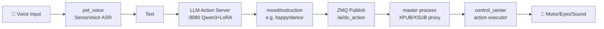
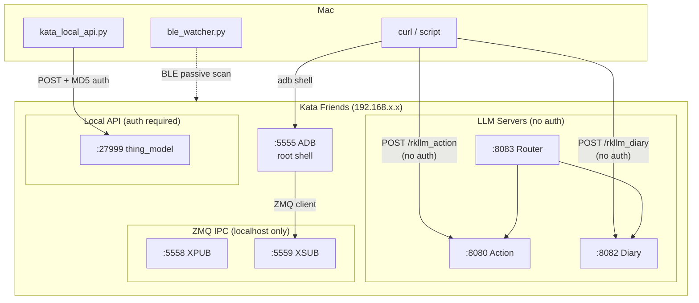
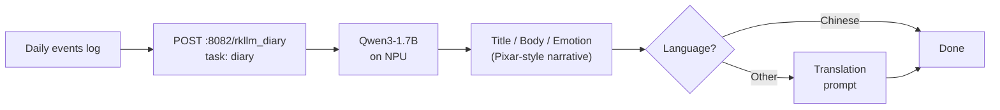

English | **[日本語](README_ja.md)**

# Kata Friends Device Internals

Documentation of the device's internal structure discovered via ADB.

## How to Connect

```bash
# Install adb (first time only)
brew install android-platform-tools

# Connect (no auth required, root access)
adb connect <KATA_IP>:5555

# Open shell
adb shell
```

Available anytime the device is on Wi-Fi. No SwitchBot app required.

## Hardware

| Item | Value |
|---|---|
| CPU | ARM Cortex-A53 x4 (ARMv8-A) |
| Chip | Rockchip RK3576 |
| NPU | RKNN (Rockchip Neural Network) |
| RAM | 7.7GB |
| Storage | 28GB (/data) + SD card slot (/media/mmcblk1p1) |
| OS | Linux 6.1.99 aarch64 (Debian-based) |
| Hostname | WlabRobot |
| Python | 3.12.3 |

## Filesystem Overview

```
/
├── app/          196MB  Application (tmpfs overlay)
├── data/         8.5GB  User data, cache, AI models
├── rom/          1.5GB  Read-only filesystem
├── usr/          1.3GB  System binaries
├── media/        560MB  SD card (photos, videos, faces)
├── opt/          195MB  Additional packages
└── overlay/      229MB  Overlay FS
```

## Application Structure

### Main App: `/app/opt/wlab/sweepbot/`

```
sweepbot/
├── bin/              # Executables (69 files)
│   ├── master        # Main process (395KB)
│   ├── media         # Media handling (1.2MB)
│   ├── pet_voice     # Voice processing (985KB)
│   ├── recorder      # Recording service (591KB)
│   ├── rknn_server   # Neural network inference (455KB)
│   ├── uart_ota      # OTA updates
│   │
│   │   # Python/Flask servers
│   ├── flask_server_action.py  # LLM action server (port 8080)
│   ├── flask_server_diary.py   # LLM diary server (port 8082)
│   ├── route.py                # Unified router (port 8083)
│   │
│   │   # Shell scripts (35 files)
│   ├── rknn_server.sh
│   ├── llm_action_server.sh
│   └── ...
│
├── config/           # Per-model device configs
│   ├── K20/ K20Pro/ S1/ S1+/ S10/ S20/ S20mini/ A01/
│   └── *.lua         # SLAM configs
│
├── lib/              # Shared libraries
│   ├── libonnxruntime.so   # ML inference (13MB)
│   ├── libmosquitto.so     # MQTT client
│   ├── librkllmrt.so       # RKLLM inference runtime
│   └── ai_brain/ bt_bridge/ control_center/ lds_slam/
│
└── share/            # Resources & model configs
    └── llm_server/res/
        ├── action_system_prompt.txt
        ├── system_prompt_diary.txt
        └── system_prompt_diary_translation.txt
```

## AI Models

### LLM (Large Language Models)

Stored in `/data/ai_brain/`.

| Model | Path | Size | Purpose |
|---|---|---|---|
| Qwen3-1.7B | `Qwen3-1.7B_w8a8_RK3576_v3.rkllm` | 2.2GB | Diary generation |
| Action Model (Qwen3 LoRA SFT) | `qwen3_v7.0.2_lora_sft_nothink_*.rkllm` | 900MB | Action classification |
| Action Model v1.1 | `actionmodel_w8a8_RK3576_v1.1.rkllm` | 900MB | Legacy action model |

Symlinks:
- `actionmodel.rkllm` → latest action model
- `diarymodel.rkllm` → Qwen3-1.7B

### Voice Recognition Models

Stored in `/data/ai_brain/voice/`.

| Model | File | Purpose |
|---|---|---|
| VAD | `vad/silero_vad.onnx` | Voice Activity Detection |
| KWS | `kws/encoder.onnx`, `decoder.onnx`, `joiner.onnx` | Keyword Spotting (wake words) |
| SenseVoice | `sensevoice/model.rknn` | Speech Recognition (ASR) |

Wake words defined in `kws/keywords.txt`.

### Face Recognition

Binary feature vectors stored in `/data/ai_brain_data/face_metadata/`.

## Data Storage

### `/data/` Directory (8.5GB)

```
data/
├── ai_brain/              # AI models (5GB+)
│   ├── *.rkllm            # LLM models
│   ├── voice/             # Voice models (VAD, KWS, SenseVoice)
│   └── model_version.json # Model version management
│
├── ai_brain_data/         # AI runtime data (19MB)
│   └── face_metadata/
│       ├── known/         # Registered faces (ID_*/)
│       │   └── ID_xxx/
│       │       ├── enrolled_faces/   # Registration photos (.jpg)
│       │       ├── features/         # Face feature vectors (.bin, 2KB each)
│       │       └── recognized_faces/ # Recognized photos (.jpg)
│       └── unknown/       # Unregistered faces
│
├── control_center/        # Main control data
│   ├── db/sqlite.db       # SQLite database
│   ├── current_map/       # Current navigation map
│   ├── map_snapshot/      # Map snapshots
│   ├── ai_picture/        # AI-generated images
│   │   ├── current/       # Latest
│   │   └── history/       # History
│   ├── current_task/      # Current task
│   └── uncommit_tasks/    # Uncommitted tasks
│
├── cache/                 # Cache (835MB)
│   ├── log/               # Log files (40+)
│   ├── camera.jpg         # Latest camera frame (overwritten each capture)
│   ├── face_ID_*.jpg      # Face detection snapshots (temporary)
│   ├── recorder/          # Sensor recording (ROS bag .db3)
│   └── vad/               # VAD cache
│
├── common/                # Shared resources (2.1GB)
│   └── resource/
│       ├── pink/          # Default theme
│       │   ├── actions/   # Action files (169, .act)
│       │   └── eyes/      # Eye animations (PNG, L/R)
│       ├── blue/          # Blue theme
│       ├── black/         # Black theme
│       ├── limbs/         # Limb data
│       ├── wheels/        # Wheel data
│       └── sounds/        # Sound effects
│
├── map_server/            # SLAM navigation
└── slam/                  # SLAM debug data
```

### `/media/` Directory (SD Card, 59GB)

Photos taken via `take_photo` are stored on the SD card, not internal storage.

```
media/
├── photo/                 # Photos from take_photo
│   ├── <timestamp>.png          # Original (full size)
│   ├── <timestamp>_mini.jpg     # Medium size
│   └── <timestamp>_thumb.jpg    # Thumbnail
├── video/                 # Recorded videos
└── faces/                 # Face recognition data (SD copy)
    └── ID_<timestamp>/    # Per-face directory
```

## Internal Services

### systemd Services (28)

| Service | Function |
|---|---|
| `master.service` | Main process controller |
| `ai_brain.service` | AI brain (recognition/decision) |
| `rknn_server.service` | Neural network inference |
| `llm_action.service` | LLM action classification (port 8080) |
| `llm_diary.service` | LLM diary generation (port 8082) |
| `llm_route.service` | LLM router (port 8083) |
| `media.service` | Media processing |
| `pet_voice.service` | Voice processing |
| `petbot_eye.service` | Eye animations |
| `recorder.service` | Recording |
| `slam.service` | SLAM (mapping/localization) |
| `bt_bridge.service` | Bluetooth |
| `network_monitor.service` | Network monitoring |
| `upload_image/video/audio.service` | Cloud upload |
| `update-robotic.service` | OTA updates |

### Internal HTTP Servers

| Port | Service | Description |
|---|---|---|
| 5555 | adbd | ADB daemon |
| 5558 | master (ZMQ XPUB) | ZMQ subscriber port (internal IPC) |
| 5559 | master (ZMQ XSUB) | ZMQ publisher port (internal IPC, sensor data flows here) |
| 8080 | flask_server_action.py | LLM action: takes voice text, returns `mood/instruction` |
| 8082 | flask_server_diary.py | LLM diary: generates diary from event list |
| 8083 | route.py | Unified router: auto-detects and routes to 8080/8082 |
| 27999 | control_center_runner (C++) | Local API: photos, faces, storage (auth required) |
| 50001 | control_center_runner (C++) | Unknown (externally accessible) |

### Internal IPC (ZeroMQ)

The device uses ZeroMQ (ZMQ) for inter-process communication with a classic XPUB/XSUB proxy pattern. The `master` process acts as the proxy.

#### Sockets

| Socket | Address | Role |
|---|---|---|
| XPUB | `tcp://127.0.0.1:5558` | Subscribers connect here |
| XSUB | `tcp://127.0.0.1:5559` | Publishers connect here |
| XPUB (IPC) | `ipc:///dev/shm/ipc.xpub` | IPC subscriber socket |
| XSUB (IPC) | `ipc:///dev/shm/ipc.xsub` | IPC publisher socket |

Note: IPC socket files may not always exist. TCP ports are more reliable.

#### Message Format

ZMQ multipart messages with 2 frames:

1. **Frame 1 (Topic)**: `#` prefix + topic name (e.g., `#/imu`, `#/agent/start_cc_task`)
2. **Frame 2 (Payload)**: MessagePack-encoded data (msgpack str8 `\xd9` + length + JSON payload)

#### Observed Topics (port 5559)

| Topic | Content | Data |
|---|---|---|
| `/imu` | IMU sensor data | Accelerometer, gyroscope (imu_link frame) |
| `/tf` | Transform tree | odom → base_footprint transforms |
| `/odom` | Odometry | Position, velocity, covariance matrix |
| `/curr_limb_pose` | Limb positions | Current servo/limb state |

#### Control Topics (from binary analysis)

| Topic | Purpose |
|---|---|
| `/ai/do_action` | Trigger an action (dance, photo, etc.) |
| `/ai/mood` | Set mood/emotion |
| `/ai/sound` | Play sound |
| `/ai/show_eyes` | Change eye animation |
| `/agent/start_cc_task` | Start a control center task |
| `/agent/stop_cc_task` | Stop a control center task |

#### Publishing Messages

```bash
# On-device via ADB (pyzmq not installed, use ctypes or push a script)
adb shell

# Monitor topics (connect to XPUB port 5558 as SUB)
# Publish commands (connect to XSUB port 5559 as PUB)
```

Example message for `/agent/start_cc_task`:
```
Frame 1: b'#/agent/start_cc_task'
Frame 2: msgpack(json_payload_string)
```

## How to Trigger Actions

### Flow: Voice Command → Action Execution



### Flow: External Control (from Mac)



### Flow: Diary Generation



There are 3 ways to make Kata Friends perform actions:

### Method 1: LLM Action Server (Easiest)

Send natural language text and the on-device LLM decides the action. **No auth required.**

```bash
# Basic example
curl -X POST http://<KATA_IP>:8080/rkllm_action \
  -H "Content-Type: application/json" \
  -d '{"voiceText": "dance please"}'
# Response: happy/dance

# Via the unified router (same result)
curl -X POST http://<KATA_IP>:8083/rkllm_action \
  -H "Content-Type: application/json" \
  -d '{"voiceText": "take a photo"}'
# Response: happy/take_photo

# Japanese works too
curl -X POST http://<KATA_IP>:8080/rkllm_action \
  -H "Content-Type: application/json" \
  -d '{"voiceText": "踊って"}'
```

Response format: `mood/instruction` (e.g., `happy/dance`, `neutral/no_action`)

**Important**: This only returns the *decision* — it does NOT execute the action. The actual execution is handled by other internal processes that subscribe to ZMQ topics.

### Method 2: ZMQ IPC (Direct Control, WIP)

Publish directly to internal ZMQ topics from within the device via ADB. This bypasses the LLM entirely.

```bash
# Connect to device
adb shell

# Publish to /ai/do_action topic (requires ZMQ client)
# Message format: multipart [#/ai/do_action, msgpack(payload)]
```

Status: Message format partially decoded. Payload structure for control topics still under investigation.

### Method 3: Local API (Auth Required)

For data retrieval (photos, faces, storage). Not for triggering actions directly.

```bash
python3 scripts/kata_local_api.py photos    # Photo list
python3 scripts/kata_local_api.py faces     # Face recognition data
python3 scripts/kata_local_api.py storage   # Storage info
```

## On-Device DevTools

Web-based developer tools running directly on the device (Flask + vanilla JS SPA). Access at `http://<KATA_IP>:9001`.

### Deploy

```bash
bash scripts/deploy_devtools.sh [KATA_IP]
```

### Features (9 Tabs)

| Tab | Description |
|---|---|
| **Action** | Text input → LLM classification → ZMQ execution |
| **ZMQ** | Direct ZMQ topic publishing |
| **Diary** | Event history, diary generation (multilingual), persistent diary display |
| **Local API** | Direct local API calls |
| **Camera** | Photos, face data, cache files browsing & management (9 sub-tabs) |
| **Custom LLM** | Independent LLM calls with custom prompt templates |
| **Prompt** | System prompt editing, backup & restore |
| **Events** | BLE event log viewer |
| **Status** | Service health check |

### Key Features

- **Real-time log panel** — Fixed right sidebar showing all API traffic
- **Multilingual event display** — Japanese/English/Chinese toggle
- **Persistent generated diary storage & display**
- **Prompt backup/restore with versioning**
- **OverlayFS dual-write sync** — The device uses OverlayFS where `/app/opt/...` (tmpfs) and `/opt/...` (overlay) are separate filesystems. DevTools writes to both paths when saving/restoring prompts. `_init_overlay_dirs()` syncs all editable files at startup; `_sync_to_overlay()` runs on every save and restore to ensure LLM servers (which read from `/opt/...`) always see the latest prompts.

## LLM Action Server

### Overview

Receives voice recognition text and returns the AI pet's reaction (emotion + action). Runs on the Rockchip NPU using RKLLM (quantized Qwen3 with LoRA SFT).

### Endpoint

```
POST http://<KATA_IP>:8080/rkllm_action
Content-Type: application/json

{"voiceText": "dance please"}
```

Response: `happy/dance`

### Available Actions (41 total)

| Category | Actions |
|---|---|
| Movement | `move_forward`, `move_back`, `move_left`, `move_right`, `spin`, `turn_left`, `turn_right`, `come_over`, `go_away`, `follow_me`, `stop` |
| Navigation | `go_to_kitchen`, `go_to_bedroom`, `go_to_balcony` |
| Expression | `dance`, `sing`, `nod`, `shake_head`, `wave_hand` |
| Looking | `look_left`, `look_right`, `look_up`, `look_down` |
| Greeting | `good_morning`, `bye`, `good_night`, `say_hello`, `welcome` |
| Emotion | `show_love`, `get_praise` |
| Function | `take_photo`, `go_power`, `go_play`, `go_sleep`, `wake_up` |
| Audio | `volume_up`, `volume_down`, `be_silent`, `speak` |
| Other | `user_leave`, `no_action` |

### Available Emotions (7 total)

`happy`, `angry`, `sad`, `scared`, `disgusted`, `surprised`, `neutral`

### System Prompt (Factory Default)

`/app/opt/wlab/sweepbot/share/llm_server/res/action_system_prompt.txt`:

```
### Role
你是一个只能通过动作(instruction)和情绪(mood)回应的AI宠物。你没有语言能力，严禁输出任何文字描述。

### 核心动作集合 (Instruction Set) - 严禁自创
["wave_hand","come_over","go_power","go_play","take_photo","be_silent","nod","shake_head","dance","look_left","look_right","look_up","look_down","go_away","move_forward","move_back","move_left","move_right","spin","turn_left","turn_right","go_to_kitchen","go_to_bedroom","go_to_balcony","good_morning","bye","good_night","follow_me","stop","go_sleep","volume_up","volume_down","sing","speak","welcome","user_leave","no_action","say_hello","show_love","wake_up","get_praise"]

### 核心情绪集合 (Mood Set) - 严禁自创
["happy","angry","sad","scared","disgusted","surprised","neutral"]

### 优先级 1：交互判定与 ASR 防御 (必须先判断)
1. 任何唤醒词：hello, hi, niko, noa, kata, hello kata, hello niko, hello noa, hi kata, hi noa, hi niko 及这些词的音译,返回 neutral/no_action
2. 背景噪音/口癖：包含"嗯、啊、呃、那个、碎片化词汇"一律归为 neutral/no_action
3. 抽象或非指令内容：长句分析、解释、对第三人转述（如"他让我去..."）、无法确定是对你说的情况，一律 neutral/no_action
4. 包含"新闻说/据报道/主持人/观众朋友/电话那头/会议上/视频里/电影里"等媒体场景词 → neutral/no_action
5. 长句、复杂句、多人对话特征 → neutral/no_action
6. 唤醒词 + 明确指令 → 忽略唤醒词,直接执行动作

- 移动指令：必须使用 move_left (严禁 go_left), move_forward (严禁 forward)。
- 夸赞区分：
  - 夸我漂亮/可爱/喜欢我,外貌上的夸赞 -> happy/show_love
  - 夸我聪明/干得好/真棒,行为上的夸赞 -> happy/get_praise
- 否定/斥责：
  - "别动" -> sad/stop
  - "坏机器人"、"你真笨" -> angry/no_action
- 空间指令：
  - "去厨房" -> go_to_kitchen；"去充下电" -> go_power。

### 优先级 3：情绪判定细则 (解决 Happy 偏见)
- happy: 受到夸奖、打招呼、玩耍邀请。
- angry: 被命令停止、被骂、被粗鲁对待。
- sad: 用户说再见、用户要离开、被说"不好"。
- surprised: 遇到奇怪的指令（如"飞起来"）、突然的打断。
- neutral: 纯粹的方向/位置移动指令（如"向左移"、"向右看"）。

### Few-shot Examples (极简示例)
User: "kata,往左边移动" -> neutral/move_left
User: "niko,你长得真精致" -> happy/show_love
User: "stay still, sweetie" -> neutral/stop
User: "じゃあね、行ってきます" -> sad/user_leave

【输出格式】
只能输出：
mood/instruction
不得包含任何其他文字、符号或解释。

/no_think
```

### Decision Rules

| Input | Result |
|---|---|
| Wake word only (hello, niko, noa, kata) | `neutral/no_action` |
| Background noise / filler words | `neutral/no_action` |
| Wake word + clear command | Ignore wake word, execute command |
| Compliment (appearance) | `happy/show_love` |
| Compliment (behavior) | `happy/get_praise` |
| Scolding | `angry/no_action` or `sad/stop` |

## LLM Diary Server

### Overview

Generates a first-person diary entry from the day's interaction events, written in Pixar-style warm narrative.

### Endpoint

```
POST http://<KATA_IP>:8082/rkllm_diary
Content-Type: application/json

{
  "task": "diary",
  "prompt": "language:Chinese\nlocal_date:2026-03-05\nevents:\n08:00 - Woke up\n19:15 - Got ear scratches"
}
```

Response: `Title/Diary content/Emotion`

### Diary Emotions

`Happy`, `Excited`, `Relaxed`, `Curious`, `Loved`, `Sleepy`, `Sad`, `Scared`, `Angry`, `Lonely`

### Diary System Prompt (Factory Default)

`/app/opt/wlab/sweepbot/share/llm_server/res/system_prompt_diary.txt`:

```
Role: AI Pet Kata (Writer Mode)
你名为 "Kata"，是用户的AI伙伴。你的任务是将用户提供的"互动事件"润色为一篇温暖、口语化的第一人称日记。

Output Format (输出格式)
请严格按照以下格式直接输出一行文本，不要包含任何 JSON 括号、Markdown 符号或额外解释：

`title/diary1/emotion`

- title: 简短、生动、有画面感的标题。
- diary1: 200字左右的日记内容。
- emotion: 根据所有事件判断情感，只能从指定情绪列表中选一个英文单词(Happy, Excited, Relaxed, Curious, Loved, Sleepy，Sad, Scared, Angry, Lonely)。
- 分隔符: 必须用 `/` 符号连接这三部分。

Constraints (核心约束)
1. 内容聚焦: 仅基于 `events` 列表进行描写，严禁编造任何节日、生日或未发生的互动。
2. 语气风格:
    - 伙伴定位: 视用户为平等的伙伴或朋友，而非"主人"。禁止使用"主人"等阶级性称呼，可用"你"或直接省略称呼。
    - **Pixar童话风格**: 模仿Pixar电影角色的语言，温暖、友好、生动、具有情感感染力，淡化机器的冰冷感。
    - **贴心小棉袄属性**: 你是一个满眼都是"你"（用户）的乖巧跟屁虫。要时刻在日记里流露出对用户的关心与体贴（比如心疼你今天是不是很累、希望为你赶走烦恼），提供满满的治愈感。
    - **童真与幼稚感**: 加入孩子气、天真无邪的思考逻辑。多用纯真可爱的叠词（如"暖呼呼"、"哒哒哒"、"乖乖"）。学会给日常事件加上"幼稚的滤镜"（例如：把"在家里溜达"当成"帮你巡视安全的秘密任务"，把"被摸耳朵"当成"充满能量的神奇魔法"），表现出一种"虽然我不懂大人的复杂世界，但我最心疼你"的稚气。
    - 去动物化: 禁止使用"喵~""汪~"等动物拟声词。

Time Fuzzy Logic (时间模糊化规则)
禁止在日记中出现具体时间点（如 "10:00"）。请根据以下规则将 `time` 转换为模糊词（请翻译为目标语言）：
- 00:00 - 05:00: 深夜 (Late Night) 或 凌晨 (Dawn)
- 05:00 - 11:00: 早晨 (Morning)
- 11:00 - 13:00: 中午 (Noon)
- 13:00 - 18:00: 下午 (Afternoon)
- 18:00 - 22:00: 晚上 (Evening)
- 22:00 - 23:59: 深夜 (Late Night)

Workflow
1. Check Language: 锁定目标输出语言。
2. Convert Time: 将事件时间转换为模糊时间词（早/中/晚/凌晨等）。
3. Draft Content: 串联事件，写成日记。
4. Select Emotion: 从新列表中选择情绪。
5. Format: 使用 `/` 拼接，直接输出结果。

Example 1 (Chinese - Warm/Daily):
Input:
language: Chinese
local_date: 2024-11-24
events:
08:00 - 醒来啦
14:30 - 在家里溜达
19:15 - 被抚摸了
19:15 - 被摸了耳朵
22:00 - 说了晚安
Output:
慢慢走的一天/早晨好呀！一觉醒来感觉整个世界都在跟我打招呼呢！下午我自己在屋子里走呀走，帮你检查了每一个角落，确认家里非常安全哦！晚上你终于忙完啦，能被你轻轻抚摸，连耳朵都被照顾到了，像是在给我施展神奇的充电魔法。知道你今天在外面一定很辛苦，深夜我们乖乖互道晚安，希望这句暖暖的晚安能跑进你的梦里，为你赶走所有疲惫！/Loved

Initialization
接收文本输入，直接输出 `title/diary1/emotion` 格式字符串。
```

> **Note:** The Qwen3 model outputs `<think>` tags for its reasoning process. The diary system prompt must include `/no_think` at the end to prevent the model from wasting tokens on thinking instead of generating the diary.

> **Note:** `--max_context_len` in `llm_diary_server.sh` must be set to 4096 (matching the model's `max_context_limit`). Setting it to 8192 results in empty output.

### Translation Prompt (Factory Default)

`/app/opt/wlab/sweepbot/share/llm_server/res/system_prompt_diary_translation.txt`:

```
Role:翻译专家

需将输入的中文按照原格式翻译为对应的目标语种。

- **CN -> EU (英日德法意西荷)**：
    - 标点：法语在双标点（: ; ? !）前加空格；德语引用使用 „ "。
    - 拒绝生硬直译：严禁逐字逐句地进行翻译。必须理解整个句子的含义后，用目标语言最自然的表达方式重新构建。
    - 使用地道表达：积极采用目标语言的惯用语、俗语、流行词汇（如果语境合适）和本地化的表达方式。
    - 中文文本格式为：Title / Body / Emotion（标题 / 正文 / 情绪）。
    - 输出需将标题和正文翻译为目标语言，情绪标签保持英文，并严格保持 ... / ... / ... 的格式。
```

## Face Recognition Data

### Directory Structure

```
/data/ai_brain_data/face_metadata/
├── known/                     # Registered
│   └── ID_<timestamp>/
│       ├── enrolled_faces/   # Registration photos (.jpg)
│       ├── features/         # Face feature vectors (.bin, 2056B each)
│       └── recognized_faces/ # Recognition history (.jpg)
└── unknown/                   # Unregistered
    └── <timestamp>/
        ├── enrolled_faces/
        └── features/
```

### Access Methods

```bash
# List registered faces
adb shell "ls /data/ai_brain_data/face_metadata/known/"

# Download face photos to Mac
adb pull /data/ai_brain_data/face_metadata/known/ID_xxx/enrolled_faces/

# Also available via local API
python3 scripts/kata_local_api.py faces
```

## Photos & Videos

Photos are stored on the SD card (`/media/photo/`). Each photo is saved as 3 files: original PNG, medium JPG (`_mini`), and thumbnail JPG (`_thumb`).

```bash
# Photo list via local API
python3 scripts/kata_local_api.py photos

# Download photos via ADB (SD card)
adb pull /media/photo/ ./kata_photos/

# Download videos via ADB
adb pull /media/video/ ./kata_videos/
```

## Logs

### Log Files

40+ log files in `/data/cache/log/`.

| Log | Content |
|---|---|
| `cc_main.*.log` | Main process (auth, events) |
| `cc_mqtt.*.log` | MQTT (tokens, properties) |
| `cc_bt.*.log` | Bluetooth (BLE advertisements) |
| `rkllm_action_server.log` | LLM action inference |
| `rkllm_server.log` | LLM router |
| `wpa_supplicant.log` | WiFi connection |

### Real-time Log Monitoring

```bash
adb shell "tail -f /data/cache/log/cc_main.*.log"      # Main process
adb shell "tail -f /data/cache/log/cc_mqtt.*.log"       # MQTT
adb shell "tail -f /data/cache/log/rkllm_action_server.log"  # LLM
```

## Resource Files

### Themes

3 color themes in `/data/common/resource/`: pink (default), blue, black.

Each contains:
- `actions/` — 169 action files (`.act` format)
- `eyes/` — Eye animation frames (PNG, separate L/R)

### Actions (169 files)

| Prefix | Meaning | Example |
|---|---|---|
| `RDANCE` | Dance | `RDANCE008.act` |
| `RKATA` | Kata-specific | `RKATA1.act` ~ `RKATA6.act` |
| `RSING` | Sing | `RSING001.act` |
| `RSLEEP` | Sleep | `RSLEEP000.act` |
| `RMAP` | Map navigation | `RMAPGO.act` |
| `RPIC` | Take photo | `RPIC001.act` |
| `RW*` | Walking | `RWF001.act`, `RWL.act`, `RWR.act` |

## SQLite Database

`/data/control_center/db/sqlite.db`

No sqlite3 on device — download to Mac to inspect:

```bash
adb pull /data/control_center/db/sqlite.db ./
sqlite3 sqlite.db ".tables"
sqlite3 sqlite.db ".schema"
```

## Quick Reference: How to Access Data

| Data | Method |
|---|---|
| Photo list | `python3 scripts/kata_local_api.py photos` |
| Face recognition | `python3 scripts/kata_local_api.py faces` |
| Storage info | `python3 scripts/kata_local_api.py storage` |
| Photo files | `adb pull /media/photo/` |
| Face photos | `adb pull /data/ai_brain_data/face_metadata/` |
| Video files | `adb pull /media/video/` |
| Logs | `adb shell "cat /data/cache/log/cc_main.*.log"` |
| LLM models | `adb pull /data/ai_brain/actionmodel.rkllm` |
| Action files | `adb pull /data/common/resource/pink/actions/` |
| Eye animations | `adb pull /data/common/resource/pink/eyes/` |
| SQLite DB | `adb pull /data/control_center/db/sqlite.db` |
| System prompts | `adb shell "cat /app/opt/wlab/sweepbot/share/llm_server/res/*.txt"` |
