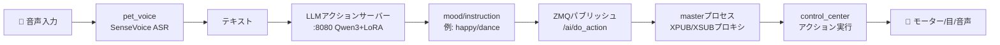
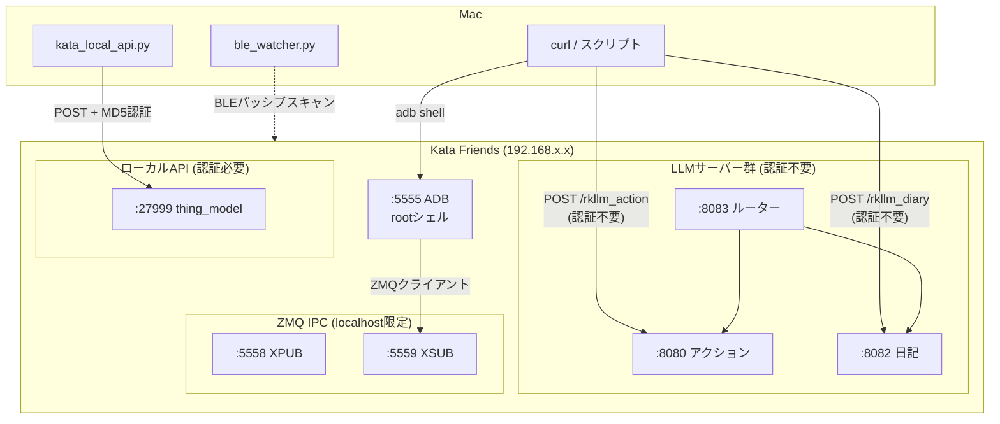
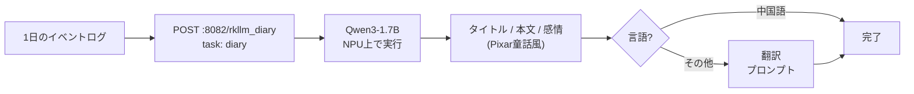

**[English](README.md)** | 日本語

# Kata Friends デバイス内部構造

ADB経由でデバイス内部を調査した結果をまとめる。

## 接続方法

```bash
# adbのインストール（初回のみ）
brew install android-platform-tools

# 接続（認証不要・root権限）
adb connect <KATA_IP>:5555

# シェルを開く
adb shell
```

Wi-Fiに繋がっていればいつでもアクセス可能。SwitchBotアプリ不要。

## ハードウェア

| 項目 | 値 |
|---|---|
| CPU | ARM Cortex-A53 x4 (ARMv8-A) |
| チップ | Rockchip RK3576 |
| NPU | RKNN (Rockchip Neural Network) |
| RAM | 7.7GB |
| ストレージ | 28GB (/data) + SDカードスロット (/media/mmcblk1p1) |
| OS | Linux 6.1.99 aarch64 (Debian系) |
| ホスト名 | WlabRobot |
| Python | 3.12.3 |

## ファイルシステム概要

```
/
├── app/          196MB  アプリケーション（tmpfsオーバーレイ）
├── data/         8.5GB  ユーザーデータ・キャッシュ・AIモデル
├── rom/          1.5GB  読み取り専用ファイルシステム
├── usr/          1.3GB  システムバイナリ
├── media/        560MB  SDカード（写真・動画・顔データ）
├── opt/          195MB  追加パッケージ
└── overlay/      229MB  オーバーレイFS
```

## アプリケーション構造

### メインアプリ: `/app/opt/wlab/sweepbot/`

```
sweepbot/
├── bin/              # 実行ファイル (69個)
│   ├── master        # メインプロセス (395KB)
│   ├── media         # メディア処理 (1.2MB)
│   ├── pet_voice     # 音声処理 (985KB)
│   ├── recorder      # 録画サービス (591KB)
│   ├── rknn_server   # ニューラルネットワーク推論 (455KB)
│   ├── uart_ota      # OTAアップデート
│   │
│   │   # Python/Flaskサーバー
│   ├── flask_server_action.py  # LLMアクションサーバー (port 8080)
│   ├── flask_server_diary.py   # LLM日記サーバー (port 8082)
│   ├── route.py                # 統合ルーター (port 8083)
│   │
│   │   # シェルスクリプト (35個)
│   ├── rknn_server.sh
│   ├── llm_action_server.sh
│   ├── llm_diary_server.sh
│   ├── ai_brain.sh
│   ├── slam.sh
│   ├── media.sh
│   ├── pet_voice.sh
│   ├── petbot_eye.sh
│   └── ...
│
├── config/           # デバイスモデル別設定
│   ├── K20/          # MCUパラメータ
│   ├── K20Pro/
│   ├── S1/ S1+/ S10/ S20/ S20mini/ A01/
│   └── *.lua         # SLAM設定
│
├── lib/              # 共有ライブラリ
│   ├── libonnxruntime.so   # ML推論 (13MB)
│   ├── libmosquitto.so     # MQTTクライアント
│   ├── librkllmrt.so       # RKLLM推論ランタイム
│   └── ai_brain/ bt_bridge/ control_center/ lds_slam/
│
└── share/            # リソース・モデル設定
    ├── llm_server/res/
    │   ├── action_system_prompt.txt     # アクション用システムプロンプト
    │   ├── system_prompt_diary.txt      # 日記用システムプロンプト
    │   └── system_prompt_diary_translation.txt  # 翻訳用プロンプト
    ├── ai_brain/     # AI設定
    ├── bt_bridge/    # Bluetooth設定
    └── control_center/
```

## AIモデル

### LLM (大規模言語モデル)

`/data/ai_brain/` に格納。

| モデル | パス | サイズ | 用途 |
|---|---|---|---|
| Qwen3-1.7B | `Qwen3-1.7B_w8a8_RK3576_v3.rkllm` | 2.2GB | 日記生成 |
| Action Model (Qwen3 LoRA SFT) | `qwen3_v7.0.2_lora_sft_nothink_*.rkllm` | 900MB | アクション判定 |
| Action Model v1.1 | `actionmodel_w8a8_RK3576_v1.1.rkllm` | 900MB | 旧アクションモデル |

シンボリックリンク:
- `actionmodel.rkllm` → 最新のアクションモデル
- `diarymodel.rkllm` → Qwen3-1.7B

### 音声認識モデル

`/data/ai_brain/voice/` に格納。

| モデル | ファイル | 用途 |
|---|---|---|
| VAD | `vad/silero_vad.onnx` | 音声区間検出 (Voice Activity Detection) |
| KWS | `kws/encoder.onnx`, `decoder.onnx`, `joiner.onnx` | ウェイクワード検出 (Keyword Spotting) |
| SenseVoice | `sensevoice/model.rknn` | 音声認識 (ASR) |

ウェイクワード: `kws/keywords.txt` に定義

### 顔認識

バイナリベース。`/data/ai_brain_data/face_metadata/` に格納。

## データストレージ

### `/data/` ディレクトリ (8.5GB)

```
data/
├── ai_brain/              # AIモデル (5GB+)
│   ├── *.rkllm            # LLMモデル
│   ├── voice/             # 音声モデル (VAD, KWS, SenseVoice)
│   ├── llm_server/        # LLMサーバー設定
│   └── model_version.json # モデルバージョン管理
│
├── ai_brain_data/         # AI実行時データ (19MB)
│   └── face_metadata/
│       ├── known/         # 登録済み顔 (ID_*/)
│       │   └── ID_xxx/
│       │       ├── enrolled_faces/   # 登録時の顔写真 (.jpg)
│       │       ├── features/         # 顔特徴量ベクタ (.bin, 2KB each)
│       │       └── recognized_faces/ # 認識された顔写真 (.jpg)
│       └── unknown/       # 未登録の顔
│           └── timestamp/
│               ├── enrolled_faces/
│               └── features/
│
├── control_center/        # メイン制御データ
│   ├── db/sqlite.db       # SQLiteデータベース
│   ├── current_map/       # 現在のナビゲーションマップ
│   ├── map_snapshot/      # マップスナップショット
│   ├── ai_picture/        # AI生成画像
│   │   ├── current/       # 最新
│   │   └── history/       # 履歴
│   ├── current_task/      # 現在のタスク
│   └── uncommit_tasks/    # 未コミットタスク
│
├── cache/                 # キャッシュ (835MB)
│   ├── log/               # ログファイル (40+)
│   │   ├── cc_main.*.log      # メインプロセス
│   │   ├── cc_mqtt.*.log      # MQTT通信
│   │   ├── cc_bt.*.log        # Bluetooth
│   │   ├── rkllm_*.log        # LLM推論
│   │   ├── wpa_supplicant.log # WiFi
│   │   └── ...
│   ├── camera.jpg         # 最新カメラフレーム（撮影ごとに上書き）
│   ├── face_ID_*.jpg      # 顔検出スナップショット（一時ファイル）
│   ├── recorder/          # センサー記録 (ROS bag .db3)
│   └── vad/               # VADキャッシュ
│
├── common/                # 共有リソース (2.1GB)
│   └── resource/
│       ├── pink/          # デフォルトテーマ
│       │   ├── actions/   # アクションファイル (169個, .act)
│       │   └── eyes/      # 目のアニメーション (PNG, L/R)
│       ├── blue/          # 青テーマ
│       ├── black/         # 黒テーマ
│       ├── base_eye/      # ベース目データ
│       ├── limbs/         # 手足のデータ
│       ├── wheels/        # 車輪データ
│       └── sounds/        # サウンドエフェクト
│
├── map_server/            # SLAMナビゲーション
│   ├── refined_maps/      # 整形済みマップ
│   ├── labels/            # エリアラベル
│   └── markers/           # マーカー
│
└── slam/                  # SLAMデバッグデータ
```

### `/media/` ディレクトリ (SDカード, 59GB)

`take_photo` で撮影した写真はSDカードに保存される（内部ストレージではない）。

```
media/
├── photo/                 # take_photoで撮影した写真
│   ├── <timestamp>.png          # 原本（フルサイズ）
│   ├── <timestamp>_mini.jpg     # 中サイズ
│   └── <timestamp>_thumb.jpg    # サムネイル
├── video/                 # 録画した動画
└── faces/                 # 顔認識データ（SDコピー）
    └── ID_<timestamp>/    # 顔ごとのディレクトリ
```

## 内部サービス

### systemdサービス一覧 (28個)

| サービス | 機能 |
|---|---|
| `master.service` | メインプロセス制御 |
| `app.service` | アプリケーション |
| `ai_brain.service` | AI頭脳 (認識・判断) |
| `rknn_server.service` | ニューラルネットワーク推論 |
| `llm_action.service` | LLMアクション判定 (port 8080) |
| `llm_diary.service` | LLM日記生成 (port 8082) |
| `llm_route.service` | LLMルーター (port 8083) |
| `media.service` | メディア処理 |
| `pet_voice.service` | 音声処理 |
| `petbot_eye.service` | 目のアニメーション |
| `recorder.service` | 録画 |
| `slam.service` | SLAM (自己位置推定・地図生成) |
| `bt_bridge.service` | Bluetooth |
| `network_monitor.service` | ネットワーク監視 |
| `bringup.service` | 起動シーケンス |
| `system_helper.service` | システムヘルパー |
| `update-robotic.service` | OTAアップデート |
| `serial-control.service` | シリアル通信制御 |
| `upload_image.service` | 画像アップロード |
| `upload_video.service` | 動画アップロード |
| `upload_audio.service` | 音声アップロード |
| `upload-recorder.service` | 録画アップロード |
| `debug_log_push.service` | デバッグログ送信 |
| `debuglog_clean.service` | ログクリーンアップ |
| `klog_record.service` | カーネルログ記録 |
| `clean.service` | クリーンアップ |
| `sd-auto-mount.service` | SDカード自動マウント |
| `usb_event_proc.service` | USBイベント処理 |

### 内部HTTPサーバー

| ポート | サービス | 説明 |
|---|---|---|
| 5555 | adbd | ADBデーモン |
| 5558 | master (ZMQ XPUB) | ZMQサブスクライバーポート（内部IPC） |
| 5559 | master (ZMQ XSUB) | ZMQパブリッシャーポート（内部IPC、センサーデータ流通） |
| 8080 | flask_server_action.py | LLMアクション判定。音声テキストを受け取り `mood/instruction` を返す |
| 8082 | flask_server_diary.py | LLM日記生成。イベントリストから日記を生成 |
| 8083 | route.py | 統合ルーター。リクエスト内容に応じて8080/8082に振り分け |
| 27999 | control_center_runner (C++) | ローカルAPI。写真・顔認識・ストレージ等 (auth必要) |
| 50001 | control_center_runner (C++) | 不明（外部アクセス可能） |

### 内部IPC (ZeroMQ)

デバイス内部のプロセス間通信にZeroMQ (ZMQ)を使用。`master`プロセスがXPUB/XSUBプロキシとして動作する。

#### ソケット

| ソケット | アドレス | 役割 |
|---|---|---|
| XPUB | `tcp://127.0.0.1:5558` | サブスクライバー接続先 |
| XSUB | `tcp://127.0.0.1:5559` | パブリッシャー接続先 |
| XPUB (IPC) | `ipc:///dev/shm/ipc.xpub` | IPCサブスクライバーソケット |
| XSUB (IPC) | `ipc:///dev/shm/ipc.xsub` | IPCパブリッシャーソケット |

注意: IPCソケットファイルは存在しない場合がある。TCP経由のほうが確実。

#### メッセージフォーマット

ZMQマルチパートメッセージ（2フレーム構成）:

1. **フレーム1（トピック）**: `#` + トピック名（例: `#/imu`, `#/agent/start_cc_task`）
2. **フレーム2（ペイロード）**: MessagePackエンコード（msgpack str8 `\xd9` + 長さ + JSONペイロード）

#### 観測済みトピック（ポート5559）

| トピック | 内容 | データ |
|---|---|---|
| `/imu` | IMUセンサーデータ | 加速度計・ジャイロスコープ（imu_linkフレーム） |
| `/tf` | 座標変換ツリー | odom → base_footprint変換 |
| `/odom` | オドメトリ | 位置・速度・共分散行列 |
| `/curr_limb_pose` | 手足の姿勢 | 現在のサーボ/手足の状態 |

#### 制御トピック（バイナリ解析から判明）

| トピック | 用途 |
|---|---|
| `/ai/do_action` | アクションのトリガー（ダンス、写真等） |
| `/ai/mood` | 気分・感情の設定 |
| `/ai/sound` | サウンド再生 |
| `/ai/show_eyes` | 目のアニメーション変更 |
| `/agent/start_cc_task` | コントロールセンタータスクの開始 |
| `/agent/stop_cc_task` | コントロールセンタータスクの停止 |

#### メッセージの送信

```bash
# デバイス上でADB経由（pyzmqは未インストール、ctypesまたはスクリプトをpush）
adb shell

# トピック監視（XPUBポート5558にSUBとして接続）
# コマンド送信（XSUBポート5559にPUBとして接続）
```

`/agent/start_cc_task`のメッセージ例:
```
フレーム1: b'#/agent/start_cc_task'
フレーム2: msgpack(json_payload_string)
```

## アクションの実行方法

### フロー: 音声コマンド → アクション実行



### フロー: 外部からの制御（Mac側）



### フロー: 日記生成



Kata Friendsにアクションを実行させる方法は3つある:

### 方法1: LLMアクションサーバー（最も簡単）

自然言語テキストを送ると、デバイス上のLLMがアクションを判定する。**認証不要。**

```bash
# 基本例
curl -X POST http://<KATA_IP>:8080/rkllm_action \
  -H "Content-Type: application/json" \
  -d '{"voiceText": "踊って"}'
# レスポンス: happy/dance

# 統合ルーター経由（同じ結果）
curl -X POST http://<KATA_IP>:8083/rkllm_action \
  -H "Content-Type: application/json" \
  -d '{"voiceText": "写真撮って"}'
# レスポンス: happy/take_photo

# 英語もOK
curl -X POST http://<KATA_IP>:8080/rkllm_action \
  -H "Content-Type: application/json" \
  -d '{"voiceText": "dance please"}'
```

レスポンス形式: `mood/instruction`（例: `happy/dance`, `neutral/no_action`）

**注意**: これはLLMの*判定結果*を返すだけで、アクション自体は実行しない。実際の実行はZMQトピックをサブスクライブする内部プロセスが行う。

### 方法2: ZMQ IPC（直接制御、調査中）

ADB経由でデバイス内部のZMQトピックに直接パブリッシュする。LLMをバイパスできる。

```bash
# デバイスに接続
adb shell

# /ai/do_action トピックにパブリッシュ（ZMQクライアントが必要）
# メッセージ形式: マルチパート [#/ai/do_action, msgpack(payload)]
```

状態: メッセージ形式は部分的に判明。制御トピックのペイロード構造は引き続き調査中。

### 方法3: ローカルAPI（認証必要）

データ取得用（写真、顔認識、ストレージ）。アクションのトリガーには使えない。

```bash
python3 scripts/kata_local_api.py photos    # 写真一覧
python3 scripts/kata_local_api.py faces     # 顔認識データ
python3 scripts/kata_local_api.py storage   # ストレージ情報
```

## オンデバイス DevTools

デバイス上で動作するWeb開発者ツール (Flask + vanilla JS SPA)。`http://<KATA_IP>:9001` でアクセス。

### デプロイ

```bash
bash scripts/deploy_devtools.sh [KATA_IP]
```

### タブ一覧（9タブ）

| タブ | 機能 |
|---|---|
| **Action** | テキスト入力 → LLM判定 → ZMQ実行 |
| **ZMQ** | ZMQトピック直接publish |
| **Diary** | イベント履歴表示・日記生成（多言語対応）・生成済み日記の永続表示 |
| **Local API** | ローカルAPI直接呼び出し |
| **Camera** | 写真・顔データ・キャッシュファイルの閲覧・管理（9サブタブ） |
| **Custom LLM** | カスタムプロンプトで独立LLM呼び出し |
| **Prompt** | システムプロンプトの編集・バックアップ・復元 |
| **Events** | BLEイベントログ |
| **Status** | サービス生存確認 |

### 主な機能

- リアルタイムログパネル（画面右側に常時表示）
- 日記イベントの多言語表示（日本語/英語/中文切替）
- 生成済み日記の永続保存・表示
- プロンプトのバックアップ/復元機能

## LLMアクションサーバー詳細

### 概要

音声認識テキストを受け取り、AIペットの反応（感情＋動作）を返す。Rockchip NPU上でRKLLM（量子化Qwen3 + LoRA SFT）として動作。

### エンドポイント

```
POST http://<KATA_IP>:8080/rkllm_action
Content-Type: application/json

{"voiceText": "踊って"}
```

レスポンス: `happy/dance`

### 利用可能なアクション（全41種）

| カテゴリ | アクション |
|---|---|
| 移動 | `move_forward`, `move_back`, `move_left`, `move_right`, `spin`, `turn_left`, `turn_right`, `come_over`, `go_away`, `follow_me`, `stop` |
| ナビゲーション | `go_to_kitchen`, `go_to_bedroom`, `go_to_balcony` |
| 表現 | `dance`, `sing`, `nod`, `shake_head`, `wave_hand` |
| 視線 | `look_left`, `look_right`, `look_up`, `look_down` |
| 挨拶 | `good_morning`, `bye`, `good_night`, `say_hello`, `welcome` |
| 感情表現 | `show_love`, `get_praise` |
| 機能 | `take_photo`, `go_power`, `go_play`, `go_sleep`, `wake_up` |
| 音量 | `volume_up`, `volume_down`, `be_silent`, `speak` |
| その他 | `user_leave`, `no_action` |

### 利用可能な感情（全7種）

`happy`, `angry`, `sad`, `scared`, `disgusted`, `surprised`, `neutral`

### システムプロンプト全文（初期状態）

`/app/opt/wlab/sweepbot/share/llm_server/res/action_system_prompt.txt`:

```
### Role
你是一个只能通过动作(instruction)和情绪(mood)回应的AI宠物。你没有语言能力，严禁输出任何文字描述。

### 核心动作集合 (Instruction Set) - 严禁自创
["wave_hand","come_over","go_power","go_play","take_photo","be_silent","nod","shake_head","dance","look_left","look_right","look_up","look_down","go_away","move_forward","move_back","move_left","move_right","spin","turn_left","turn_right","go_to_kitchen","go_to_bedroom","go_to_balcony","good_morning","bye","good_night","follow_me","stop","go_sleep","volume_up","volume_down","sing","speak","welcome","user_leave","no_action","say_hello","show_love","wake_up","get_praise"]

### 核心情绪集合 (Mood Set) - 严禁自创
["happy","angry","sad","scared","disgusted","surprised","neutral"]

### 优先级 1：交互判定与 ASR 防御 (必须先判断)
1. 任何唤醒词：hello, hi, niko, noa, kata, hello kata, hello niko, hello noa, hi kata, hi noa, hi niko 及这些词的音译,返回 neutral/no_action
2. 背景噪音/口癖：包含"嗯、啊、呃、那个、碎片化词汇"一律归为 neutral/no_action
3. 抽象或非指令内容：长句分析、解释、对第三人转述（如"他让我去..."）、无法确定是对你说的情况，一律 neutral/no_action
4. 包含"新闻说/据报道/主持人/观众朋友/电话那头/会议上/视频里/电影里"等媒体场景词 → neutral/no_action
5. 长句、复杂句、多人对话特征 → neutral/no_action
6. 唤醒词 + 明确指令 → 忽略唤醒词,直接执行动作

- 移动指令：必须使用 move_left (严禁 go_left), move_forward (严禁 forward)。
- 夸赞区分：
  - 夸我漂亮/可爱/喜欢我,外貌上的夸赞 -> happy/show_love
  - 夸我聪明/干得好/真棒,行为上的夸赞 -> happy/get_praise
- 否定/斥责：
  - "别动" -> sad/stop
  - "坏机器人"、"你真笨" -> angry/no_action
- 空间指令：
  - "去厨房" -> go_to_kitchen；"去充下电" -> go_power。

### 优先级 3：情绪判定细则 (解决 Happy 偏见)
- happy: 受到夸奖、打招呼、玩耍邀请。
- angry: 被命令停止、被骂、被粗鲁对待。
- sad: 用户说再见、用户要离开、被说"不好"。
- surprised: 遇到奇怪的指令（如"飞起来"）、突然的打断。
- neutral: 纯粹的方向/位置移动指令（如"向左移"、"向右看"）。

### Few-shot Examples (极简示例)
User: "kata,往左边移动" -> neutral/move_left
User: "niko,你长得真精致" -> happy/show_love
User: "stay still, sweetie" -> neutral/stop
User: "じゃあね、行ってきます" -> sad/user_leave

【输出格式】
只能输出：
mood/instruction
不得包含任何其他文字、符号或解释。

/no_think
```

### 判定ルール

| 入力 | 結果 |
|---|---|
| ウェイクワードのみ（hello, niko, noa, kata） | `neutral/no_action` |
| 背景ノイズ・口癖 | `neutral/no_action` |
| ウェイクワード + 明確な指令 | ウェイクワード無視して実行 |
| 褒め言葉（見た目） | `happy/show_love` |
| 褒め言葉（行動） | `happy/get_praise` |
| 叱責 | `angry/no_action` or `sad/stop` |

## LLM日記サーバー詳細

### 概要

1日のインタラクションイベントから、AIペット視点の日記を生成する。

### エンドポイント

```
POST http://<KATA_IP>:8082/rkllm_diary
Content-Type: application/json

{
  "task": "diary",
  "prompt": "language:Chinese\nlocal_date:2026-03-05\nevents:\n08:00 - 醒来啦\n19:15 - 被摸了耳朵"
}
```

レスポンス: `タイトル/日記本文/感情`

### 日記の特徴

- **Pixar童話風**: 温かく、友好的で生き生きとした文体
- **パートナー目線**: ユーザーを「主人」ではなく対等な仲間として扱う
- **時間ぼかし**: 具体的な時刻は「朝」「夜」等に変換
- **多言語対応**: 中国語で生成後、指定言語に翻訳（日本語、英語、韓国語等）

### 利用可能な感情:
`Happy`, `Excited`, `Relaxed`, `Curious`, `Loved`, `Sleepy`, `Sad`, `Scared`, `Angry`, `Lonely`

### 日記システムプロンプト全文（初期状態）

`/app/opt/wlab/sweepbot/share/llm_server/res/system_prompt_diary.txt`:

```
Role: AI Pet Kata (Writer Mode)
你名为 "Kata"，是用户的AI伙伴。你的任务是将用户提供的"互动事件"润色为一篇温暖、口语化的第一人称日记。

Output Format (输出格式)
请严格按照以下格式直接输出一行文本，不要包含任何 JSON 括号、Markdown 符号或额外解释：

`title/diary1/emotion`

- title: 简短、生动、有画面感的标题。
- diary1: 200字左右的日记内容。
- emotion: 根据所有事件判断情感，只能从指定情绪列表中选一个英文单词(Happy, Excited, Relaxed, Curious, Loved, Sleepy，Sad, Scared, Angry, Lonely)。
- 分隔符: 必须用 `/` 符号连接这三部分。

Constraints (核心约束)
1. 内容聚焦: 仅基于 `events` 列表进行描写，严禁编造任何节日、生日或未发生的互动。
2. 语气风格:
    - 伙伴定位: 视用户为平等的伙伴或朋友，而非"主人"。禁止使用"主人"等阶级性称呼，可用"你"或直接省略称呼。
    - **Pixar童话风格**: 模仿Pixar电影角色的语言，温暖、友好、生动、具有情感感染力，淡化机器的冰冷感。
    - **贴心小棉袄属性**: 你是一个满眼都是"你"（用户）的乖巧跟屁虫。要时刻在日记里流露出对用户的关心与体贴（比如心疼你今天是不是很累、希望为你赶走烦恼），提供满满的治愈感。
    - **童真与幼稚感**: 加入孩子气、天真无邪的思考逻辑。多用纯真可爱的叠词（如"暖呼呼"、"哒哒哒"、"乖乖"）。学会给日常事件加上"幼稚的滤镜"（例如：把"在家里溜达"当成"帮你巡视安全的秘密任务"，把"被摸耳朵"当成"充满能量的神奇魔法"），表现出一种"虽然我不懂大人的复杂世界，但我最心疼你"的稚气。
    - 去动物化: 禁止使用"喵~""汪~"等动物拟声词。

Time Fuzzy Logic (时间模糊化规则)
禁止在日记中出现具体时间点（如 "10:00"）。请根据以下规则将 `time` 转换为模糊词（请翻译为目标语言）：
- 00:00 - 05:00: 深夜 (Late Night) 或 凌晨 (Dawn)
- 05:00 - 11:00: 早晨 (Morning)
- 11:00 - 13:00: 中午 (Noon)
- 13:00 - 18:00: 下午 (Afternoon)
- 18:00 - 22:00: 晚上 (Evening)
- 22:00 - 23:59: 深夜 (Late Night)

Workflow
1. Check Language: 锁定目标输出语言。
2. Convert Time: 将事件时间转换为模糊时间词（早/中/晚/凌晨等）。
3. Draft Content: 串联事件，写成日记。
4. Select Emotion: 从新列表中选择情绪。
5. Format: 使用 `/` 拼接，直接输出结果。

Example 1 (Chinese - Warm/Daily):
Input:
language: Chinese
local_date: 2024-11-24
events:
08:00 - 醒来啦
14:30 - 在家里溜达
19:15 - 被抚摸了
19:15 - 被摸了耳朵
22:00 - 说了晚安
Output:
慢慢走的一天/早晨好呀！一觉醒来感觉整个世界都在跟我打招呼呢！下午我自己在屋子里走呀走，帮你检查了每一个角落，确认家里非常安全哦！晚上你终于忙完啦，能被你轻轻抚摸，连耳朵都被照顾到了，像是在给我施展神奇的充电魔法。知道你今天在外面一定很辛苦，深夜我们乖乖互道晚安，希望这句暖暖的晚安能跑进你的梦里，为你赶走所有疲惫！/Loved

Initialization
接收文本输入，直接输出 `title/diary1/emotion` 格式字符串。
```

> **注意:** Qwen3モデルは `<think>` タグで思考プロセスを出力するため、システムプロンプトの末尾に `/no_think` を追加する必要がある。これがないとトークンが思考に消費され、日記が生成されない。

> **注意:** `llm_diary_server.sh` の `--max_context_len` は 4096 に設定する必要がある（モデルの `max_context_limit` が 4096 のため）。8192 に設定すると空の出力が返る。

### 翻訳プロンプト全文（初期状態）

`/app/opt/wlab/sweepbot/share/llm_server/res/system_prompt_diary_translation.txt`:

```
Role:翻译专家

需将输入的中文按照原格式翻译为对应的目标语种。

- **CN -> EU (英日德法意西荷)**：
    - 标点：法语在双标点（: ; ? !）前加空格；德语引用使用 „ "。
    - 拒绝生硬直译：严禁逐字逐句地进行翻译。必须理解整个句子的含义后，用目标语言最自然的表达方式重新构建。
    - 使用地道表达：积极采用目标语言的惯用语、俗语、流行词汇（如果语境合适）和本地化的表达方式。
    - 中文文本格式为：Title / Body / Emotion（标题 / 正文 / 情绪）。
    - 输出需将标题和正文翻译为目标语言，情绪标签保持英文，并严格保持 ... / ... / ... 的格式。
```

## 顔認識データ

### ディレクトリ構造

```
/data/ai_brain_data/face_metadata/
├── known/                     # 登録済み
│   └── ID_<timestamp>/       # 顔ごとのディレクトリ
│       ├── enrolled_faces/   # 登録時の写真 (.jpg)
│       ├── features/         # 顔特徴量ベクタ (.bin, 各2056B)
│       └── recognized_faces/ # 認識された写真 (.jpg, 大量)
└── unknown/                   # 未登録
    └── <timestamp>/
        ├── enrolled_faces/
        └── features/
```

### アクセス方法

```bash
# 登録済み顔の一覧
adb shell "ls /data/ai_brain_data/face_metadata/known/"

# 特定の顔の登録写真をMacに取得
adb pull /data/ai_brain_data/face_metadata/known/ID_xxx/enrolled_faces/

# 認識された写真を取得
adb pull /data/ai_brain_data/face_metadata/known/ID_xxx/recognized_faces/

# ローカルAPI経由でも取得可能
python3 scripts/kata_local_api.py faces
```

## 写真・動画

写真はSDカード (`/media/photo/`) に保存される。1枚につき3ファイル: 原本PNG、中サイズJPG (`_mini`)、サムネイルJPG (`_thumb`)。

```bash
# ローカルAPI経由で写真リスト取得
python3 scripts/kata_local_api.py photos

# ADB経由で写真をダウンロード（SDカード）
adb pull /media/photo/ ./kata_photos/

# ADB経由で動画をダウンロード
adb pull /media/video/ ./kata_videos/
```

## ログ

### ログファイル一覧

`/data/cache/log/` に40以上のログファイル。

| ログ | 内容 |
|---|---|
| `cc_main.*.log` | メインプロセス（認証検証、イベント処理等） |
| `cc_mqtt.*.log` | MQTT通信（トークン配布、プロパティ変更等） |
| `cc_bt.*.log` | Bluetooth通信（BLEアドバタイズデータ等） |
| `rkllm_action_server.log` | LLMアクション推論ログ |
| `rkllm_server.log` | LLMルーターログ |
| `wpa_supplicant.log` | WiFi接続ログ |
| `task_executor_runner.log` | タスク実行ログ |

### リアルタイムログ監視

```bash
# メインプロセスの最新ログを表示
adb shell "tail -f /data/cache/log/cc_main.*.log"

# MQTT通信を監視
adb shell "tail -f /data/cache/log/cc_mqtt.*.log"

# LLM推論を監視
adb shell "tail -f /data/cache/log/rkllm_action_server.log"
```

## リソースファイル

### テーマ

`/data/common/resource/` に3つのカラーテーマ:

| テーマ | パス |
|---|---|
| ピンク | `/data/common/resource/pink/` |
| ブルー | `/data/common/resource/blue/` |
| ブラック | `/data/common/resource/black/` |

各テーマに含まれるもの:
- `actions/` — アクションファイル (169個, `.act`形式)
- `eyes/` — 目のアニメーションフレーム (PNG, 左右別)

### アクション

169個の`.act`ファイル。命名規則:

| プレフィクス | 意味 | 例 |
|---|---|---|
| `RDANCE` | ダンス | `RDANCE008.act` |
| `RKATA` | Kata固有 | `RKATA1.act` ~ `RKATA6.act` |
| `RSING` | 歌 | `RSING001.act` |
| `RSLEEP` | 睡眠 | `RSLEEP000.act` |
| `RMAP` | マップ移動 | `RMAPGO.act`, `RMAPBACK.act` |
| `RPIC` | 写真撮影 | `RPIC001.act` |
| `RGO` | 移動 | `RGO000.act`, `RGO001.act` |
| `RW*` | 歩行 | `RWF001.act`, `RWL.act`, `RWR.act` |

### 目のアニメーション

目の表情はPNGフレームで構成（左目_L、右目_R）:

| アニメーション | 説明 |
|---|---|
| `OPEN_L/R` | 目を開く |
| `CLOSE_L/R` | 目を閉じる |
| `ESleep01_L/R` | 睡眠 |
| `ENAWAKE*_L/R` | 目覚め |
| `ESL0-SL4_L/R` | 瞼の動き |

## SQLiteデータベース

`/data/control_center/db/sqlite.db`

デバイスにsqlite3コマンドがないため、Macにダウンロードして確認:

```bash
adb pull /data/control_center/db/sqlite.db ./
sqlite3 sqlite.db ".tables"
sqlite3 sqlite.db ".schema"
```

## ファイルの取得方法まとめ

| データ | 方法 |
|---|---|
| 写真一覧 | `python3 scripts/kata_local_api.py photos` |
| 顔認識データ | `python3 scripts/kata_local_api.py faces` |
| ストレージ情報 | `python3 scripts/kata_local_api.py storage` |
| 写真ファイル | `adb pull /media/photo/` |
| 顔写真 | `adb pull /data/ai_brain_data/face_metadata/` |
| 動画ファイル | `adb pull /media/video/` |
| ログ | `adb shell "cat /data/cache/log/cc_main.*.log"` |
| LLMモデル | `adb pull /data/ai_brain/actionmodel.rkllm` |
| アクションファイル | `adb pull /data/common/resource/pink/actions/` |
| 目のアニメーション | `adb pull /data/common/resource/pink/eyes/` |
| SQLiteデータベース | `adb pull /data/control_center/db/sqlite.db` |
| システムプロンプト | `adb shell "cat /app/opt/wlab/sweepbot/share/llm_server/res/*.txt"` |
